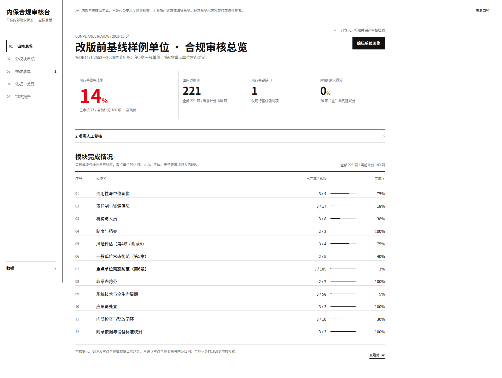
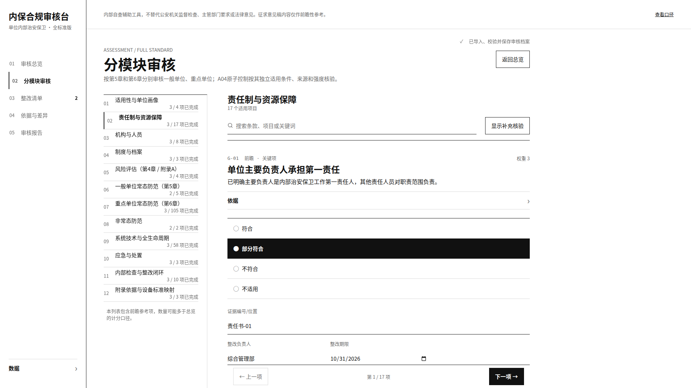
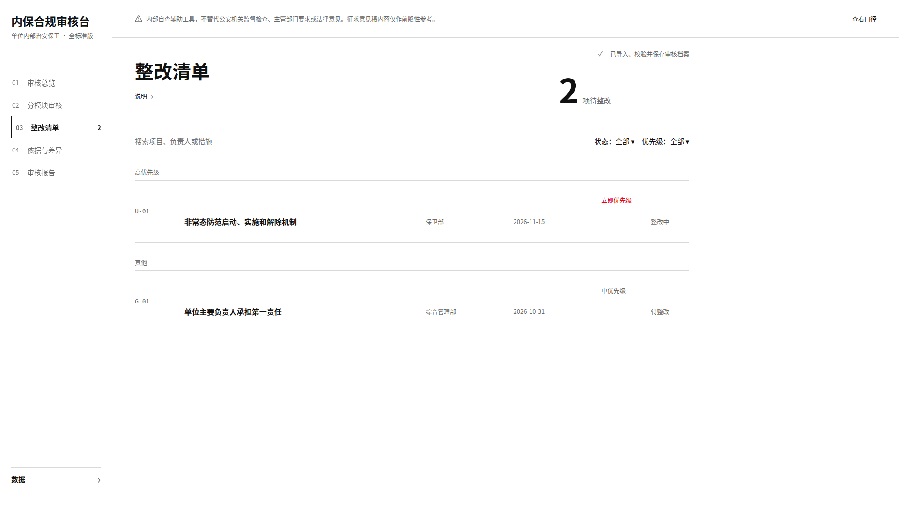
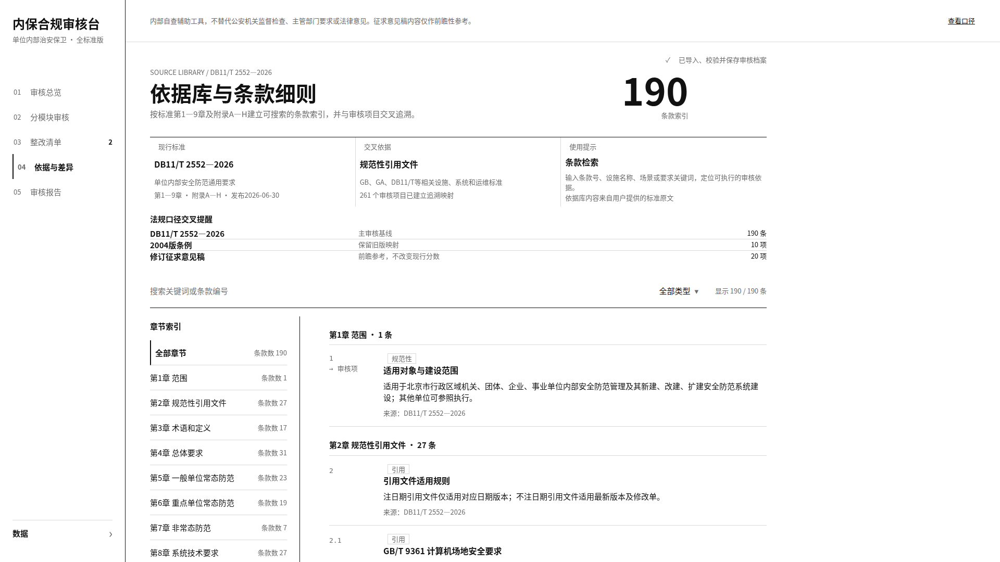
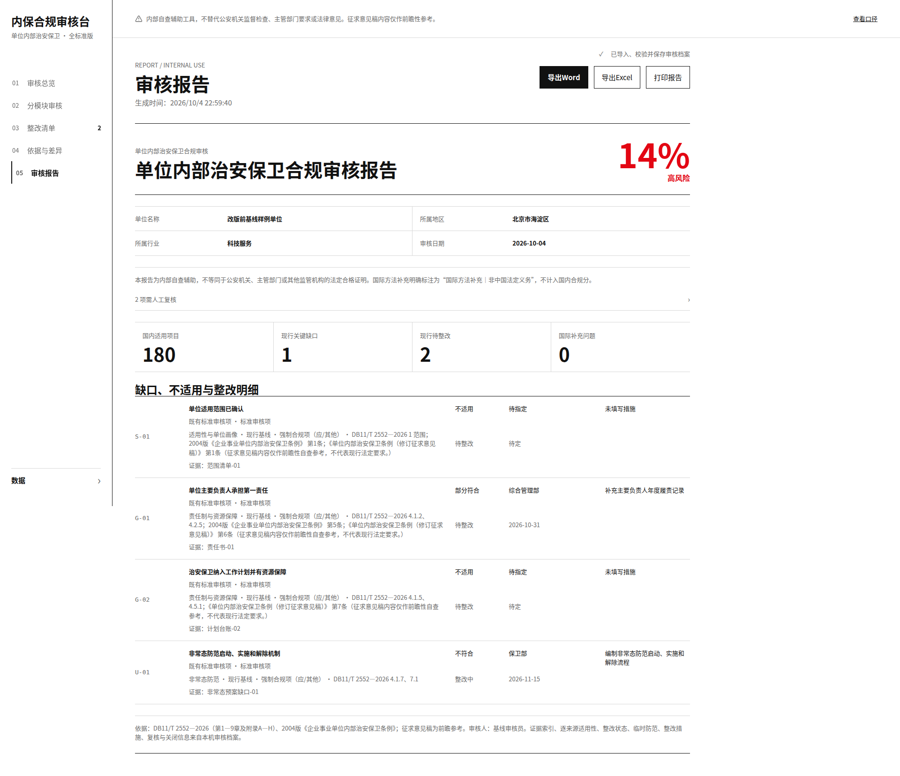
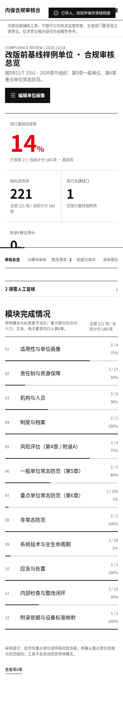

# 单位内部治安保卫合规审核台

A local-first React/Vite workbench for internal public-security compliance self-audits.

面向单位内部治安保卫自查的本地优先审核工作台，按北京市地方标准 **DB11/T 2552—2026** 组织审核条目、依据映射、整改跟踪与报告导出。

在线地址：<https://audit.sec-chai.com/>

> 本 README 只记录仓库中可以核实的实现事实，不复述标准原文，也不替代项目中的业务规则、统计口径或验收报告。

## 免责声明

- 本工具是**内部自查辅助工具**，不替代公安机关监督检查、主管部门要求或法律意见。
- 征求意见稿内容仅作前瞻性参考，不代表现行法定要求。
- 国际方法补充保留在审核档案、导出和整改范围中，但不计入国内合规分。
- 审核结论仍需结合单位实际情况、适用的法律法规、标准、主管部门要求和专业判断。

## 截图

以下截图使用仓库中的 `baseline/sample.json` 样例数据生成；单位名称为“改版前基线样例单位”，不含真实单位资料。截图为整页截图，文件像素宽度分别为 1920 或 390。

| 页面 | 桌面截图（1920 宽） |
|---|---|
| 审核总览 |  |
| 分模块审核 |  |
| 整改清单 |  |
| 依据与差异 |  |
| 审核报告 |  |

手机端样例（390 宽）：



## 功能概览

### 五个页面

1. **审核总览**：显示完成率、风险级别、关键缺口、整改数量、建议项得分和模块完成情况；支持进入指定模块或重点单位筛查入口。
2. **分模块审核**：按模块列出适用审核条款，支持搜索、补充核验开关、条款定位、证据记录、判定、整改信息和键盘操作。
3. **整改清单**：集中查看部分符合或不符合的整改项，支持按搜索词、状态和优先级筛选，并编辑负责人、期限、措施、复核和关闭信息。
4. **依据与差异**：提供审核条款索引、章节筛选、关键词搜索、来源映射和法规口径提示；来源条款只有在精确且唯一适用时才生成跳转。
5. **审核报告**：展示单位画像、统计摘要、人工复核、缺口/不适用/整改明细，支持 Word、Excel 导出和浏览器打印。

### 数据操作与规则

- 支持导入和导出 JSON 档案。
- 支持导出 Word（`.docx`）、Excel（`.xlsx`）和打印报告。
- A04 原子控制包含适用条件、来源适用性、结构化指标、子断言、证据和复核字段；结构化判定可能影响父项的有效结论。
- “不适用”结论会经过有效性规则检查；A04 类条款的无效“不适用”理由和未完成的人工复核条件会被提示。
- 整改标记为已关闭前，需要补齐关闭所需的整改与复核信息，包括复核证据、复核人员和复核日期；关闭条件的完整定义以 `client/src/lib/scoring.ts` 和现有界面为准。
- 旧版本 JSON 在当前存储规范允许的版本范围内可导入；导入会执行版本、字段、日期、枚举、长度和条款 ID 校验。

## 数据与隐私

### 当前静态审核入口

- 审核画像、答案、证据、整改和复核信息保存在当前浏览器的 `localStorage`，键名为 `neibao-audit-v1`；存储实现位于 `client/src/lib/storage.ts`。
- `client/src/main.tsx` 使用静态、local-first 审核工作台入口；它不会为了渲染或编辑审核档案创建浏览器端 tRPC/React Query 客户端，也不会发起后台 API 请求。
- 当前静态入口不要求用户登录。仓库中的通用服务端目录仍包含 OAuth、数据库和存储代理代码；这些服务端能力不等同于 `pnpm build:static` 产物的本地审核行为，使用 `pnpm dev` 启动完整服务端时应另行核查运行配置。
- 仓库代码中未发现用于本审核页面的统计脚本或外部分析调用；网页入口使用本仓库构建的静态资源。
- 换浏览器、清除站点数据或清除该站点的本地存储后，本机草稿可能无法恢复。清空本地数据前应先使用“导出 JSON”备份。
- JSON 导出文件可能包含单位画像、审核答案、证据、整改和复核信息，应由使用者自行妥善保管，不要提交真实档案到仓库。

### 仓库中可见的服务端代码边界

仓库还包含 `server/`、`drizzle/` 和通用平台集成文件。它们不是本 README 对静态部署本地保存行为的隐含承诺；若改用完整服务端运行方式，应单独审计登录、数据库、上传和外部请求配置。

## 技术栈

以下内容来自 `package.json`、入口文件和源码目录：

- React 19、React DOM、TypeScript、Vite。
- Tailwind CSS 相关构建依赖与项目自定义 CSS 变量。
- Vitest 用于测试；Playwright Core 与系统 Chromium 用于桌面、手机截图和触控检查。
- `docx` 用于 Word 报告生成；`xlsx` 用于 Excel 报告生成。
- Node.js 服务端代码使用 Express、tRPC 相关包和 Drizzle 相关包；静态部署使用 `build:static`。
- 包管理器版本在 `package.json` 中声明为 `pnpm@10.18.0`。

## 目录结构

```text
.
├── client/
│   ├── public/              静态公开资源
│   └── src/
│       ├── App.tsx          应用页面、状态协调和页面布局
│       ├── components/      页面组件与通用组件
│       ├── data/            审核条目、A04 控制和依据映射数据
│       ├── lib/             存储、评分、导出和日期等业务支持代码
│       └── styles/           设计变量，包括 tokens.css
├── server/                  完整服务端入口、认证和平台集成代码
├── shared/                  客户端与服务端共享代码
├── drizzle/                 数据库迁移和元数据
├── baseline/                样例 JSON、预期统计和基线截图
├── after/                   已保存的桌面验收截图
├── docs/                    功能清单、统计口径和交付文档
├── scripts/                 回归、截图、桌面和触控检查脚本
├── package.json              脚本、依赖和包管理器声明
└── pnpm-lock.yaml            依赖锁定文件
```

主要设计和业务文件：

- `client/src/styles/tokens.css`：字体、颜色、字号、间距、边框、圆角、阴影和布局尺寸变量。
- `client/src/index.css`：全局样式和桌面媒体查询；手机端规则与桌面端规则分开维护。
- `client/src/lib/scoring.ts`：评分、有效结论、人工复核和整改关闭条件的实现。
- `client/src/lib/storage.ts`：本机保存、读取、清除和 JSON 档案规范化。
- `client/src/lib/reportExport.ts`：Word、Excel 报告导出实现。

## 本地开发

仓库未在 `package.json` 中声明 `engines`。当前验证环境使用 Node.js 22.x；建议使用 Node.js 22.x，并使用仓库声明的 pnpm 版本。

```bash
# 安装依赖
pnpm install --frozen-lockfile

# 开发模式：启动完整项目开发入口
pnpm dev

# 静态开发预览
pnpm dev:static

# 构建静态站点，产物输出到 dist/public
pnpm build:static

# 构建完整项目
pnpm build

# 启动完整项目构建产物
pnpm start
```

如果只检查静态审核台，优先使用 `pnpm build:static`；完整 `pnpm dev`/`pnpm start` 还会涉及仓库中的服务端代码和运行配置。

## 质量检查

### 功能与基线

```bash
npm run check
```

该命令执行 TypeScript 类型检查、Vitest 测试和 `scripts/baseline-check.ts`。基线脚本会：

- 导入 `baseline/sample.json`；
- 读取总览、审核页、整改页和报告页的关键统计；
- 与 `baseline/expected.json` 对比；
- 验证 JSON 导出结构和精确往返；
- 确认 Word、Excel 文件能够生成。

### 桌面、手机和触控

```bash
npm run check:desktop
npm run check:mobile
npm run check:touch
```

- `check:desktop`：构建静态站点，在 1024、1280、1920、2560 等桌面宽度检查根字号、内容区、侧栏、横向滚动、窄桌面断行、报告计数标签、整改六列对齐、自定义下拉键盘行为和 A04 方向键隔离。
- `check:mobile`：使用样例 JSON，在 390×844 截取五个页面，并与 `baseline/mobile/390x844/` 逐像素比较；当前要求差异为 0，同时保存桌面基线截图。
- `check:touch`：在 390 宽度测量五个页面的可点击/可聚焦热区，检查不小于 44×44px 以及相邻热区重叠。

样例与基线文件：

- `baseline/sample.json`：回归样例档案，覆盖多个模块及四种判定状态，并包含无理由“不适用”和整改项。
- `baseline/expected.json`：样例关键统计和 JSON 结构预期。
- `baseline/mobile/`：手机像素基线。
- `baseline/desktop/`：桌面截图基线。

手机像素基线是验收约束。任何桌面样式改动必须写在 `@media (min-width: 1024px)` 内，且不得改变手机像素；如确需更新基线，应先说明原因，不能把预期文案变化直接当作无条件通过。

## 设计规范

项目采用瑞士/国际主义平面风格：

- 黑、白、灰为主；信号红只用于“不符合”“高风险”“关键缺口”和错误提示。
- “高优先级”文字保持红色。
- 无阴影、无圆角、无渐变、无彩色底色标签。
- 桌面端使用左侧固定导航和 12 栏网格；手机端保留既有移动端设计。
- 统一字体变量位于 `client/src/styles/tokens.css`：Inter、Noto Sans SC / Source Han Sans SC；编号使用等宽字体和等宽数字。
- 设计变量文件同时包含字号、颜色、8px 基础间距、控制高度、侧栏和各页面布局尺寸。
- 桌面断点由 `client/src/index.css` 和桌面检查脚本共同验证：1024–1599px 根字号 15px、1600–2199px 根字号 16px、≥2200px 根字号 18px；对应内容区上限为 1040px、1280px、1600px。侧栏按根字号使用 15rem，因而实测宽度随断点字号变化。
- 条款编号使用统一的 12px 等宽灰色样式；桌面布局尺寸使用 rem 令牌，编号本身遵循统一字号令牌而不是页面单独硬编码。

## 统计口径说明

以下定义只引用 `docs/口径说明.md` 已有说明：

- **总览“国内适用项 221”**：当前画像下全部现行国内适用项，包含建议项和仍会被 A04 原子控制替代的旧父项；不包含国际补充项。
- **总览“当前计分 180”**：现行国内强制计分集合，排除有效“不适用”项、建议项，并对被 A04 原子控制覆盖的旧父项去重。
- **分模块审核列表 222**：审核页使用允许前瞻依据的 `active` 集合，因此可能比总览国内适用集合多出前瞻项目。
- **报告“现行基线计分项目 180”**：报告读取同一个 `current.counted` 计分集合，与总览当前计分分母对应。

这些数字属于仓库当前 `baseline/sample.json` 样例结果，不是所有单位档案的固定结果。完整定义及源码位置见 [`docs/口径说明.md`](docs/口径说明.md)。

## 已知限制与规则范围

- “不适用”理由写“未安装/未设置”的无效判定只对 A04 类条款强制；普通条款对此只是提示，不强制按同一规则判 invalid。
- 桌面端筛选和 A04 结构化字段使用自定义选择组件；手机端保留浏览器原生下拉。
- 手机端仍有后续可改进事项：报告页标题与横线间距、信息表第二行缩进、报告按钮图标、`textarea` 拖拽角标。若要处理这些项目，应先更新手机像素基线并说明原因。
- A04 表单仍显示部分内部标识符，例如 `calendar_month`、`maximum_gap`。
- 当前截图和基线使用样例数据，不代表任何真实单位的审核结果。

## 发布流程

“提交推送到 GitHub”和“发布到线上”是两件事：

1. 在本地完成检查并提交 Git commit。
2. 将 `main` 推送到 GitHub 仓库 `chailu85/nbaudit`，用于代码同步和版本跟踪。
3. 将同一提交推送到已配置的 Manus/WebDev 规范远程；当前项目配置的 `auto_publish` 为启用状态，WebDev 会据此构建 `dist/public` 并提交线上发布。
4. 通过以下方式确认线上是最新提交：比较本地、GitHub `main`、Manus 规范远程 `main` 的 commit SHA；再检查线上 HTML 引用的 JS/CSS 资源与本地 `dist/public` 对应资源的 SHA-256 是否一致。

不要把密钥、令牌、真实单位 JSON 或生成的真实报告提交到仓库。

## 版本与里程碑

- 当前提交：`0fbccf934cbf9908d2baeb5aa084913a83cff630`
- 当前提交日期：2026-10-05
- 主要里程碑：
  1. 建立改版前基线、样例 JSON、预期统计和自动检查脚本；
  2. 建立瑞士/国际主义桌面框架和三档响应式网格；
  3. 完成审核总览、分模块审核、整改清单、依据与差异、审核报告的页面重做；
  4. 完成条款跨页定位、来源精确映射、自定义桌面下拉、A04 键盘隔离、窄桌面断行和手机触控热区 QA 修复；
  5. 当前版本修复报告计数标签重复和整改清单桌面六列错位，并通过功能、桌面、手机像素和触控检查。

详细交付与验收记录见 [`docs/最终改版总结与验收报告.md`](docs/最终改版总结与验收报告.md) 和 [`docs/第6轮全站收尾变更清单.md`](docs/第6轮全站收尾变更清单.md)。

## 许可证

**许可证：待定。**

`package.json` 当前包含 `"license": "MIT"` 字段，但项目正式许可证选择仍需确认；请在发布前明确许可证并同步更新相关文件。
